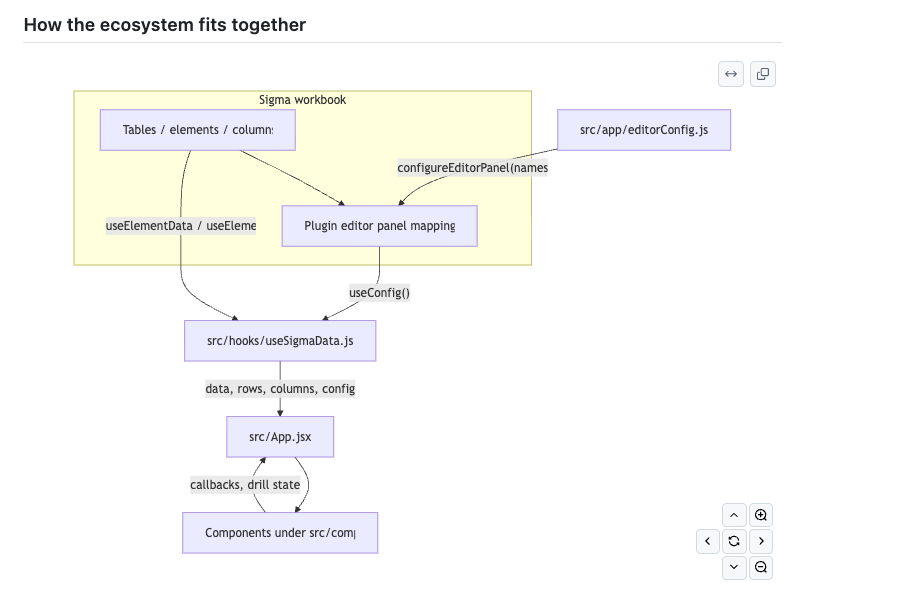

# SALT — All JSX files & ecosystem overview

**Purpose:** Long-lived map of every `.jsx` file in `salt_app`, what it owns, and how pieces connect. Use this alongside the root [`README.md`](./README.md) for onboarding and refactors.

**Scope:** Files ending in `.jsx` only. Important `.js` companions (e.g. `editorConfig.js`, `useSigmaData.js`, hooks) are summarized in [Ecosystem (beyond JSX)](#ecosystem-beyond-jsx).

**Last reviewed:** 2026-05-15 — regenerate sections when large new surfaces land.

---

## Table of contents

1. [How the ecosystem fits together](#how-the-ecosystem-fits-together)
2. [Ecosystem (beyond JSX)](#ecosystem-beyond-jsx)
3. [Directory map](#directory-map)
4. [File catalog (alphabetical by path)](#file-catalog-alphabetical-by-path)
5. [`App.jsx` — what lives in the main shell](#appjsx--what-lives-in-the-main-shell)
6. [UI patterns used across the app](#ui-patterns-used-across-the-app)

---

## How the ecosystem fits together

**Call chain (runtime):** `main.jsx` mounts `App` → `App` calls `useSigmaData(...)` → hook registers `editorConfig` with Sigma and subscribes to configured elements → `App` branches on persona (CEO / CFO / CRO / …), passes slices of `data` / `rows` into cards, charts, and modals.

**Authoring chain (workbook):** Data engineers / analytics authors wire each `editorConfig` entry to the correct Sigma element or column. React code **never** hardcodes Sigma element IDs; it reads **`config.<name>`** and row keys derived from those bindings.

---

## Ecosystem (beyond JSX)

| Path | Role |
|------|------|
| `src/app/editorConfig.js` | Declares Sigma panel: `element` vs `column` + `source`. Drives URL size; keep lean. |
| `src/hooks/useSigmaData.js` | Single aggregation hook: `configureEditorPanel`, all `useElementData` calls, normalization, derived `data` objects. |
| `src/hooks/useDerivedMetrics.js` | Metric derivations consumed by `App.jsx`. |
| `src/hooks/useExecutiveInsights.js` | Executive insight selection/copy helpers. |
| `src/components/debug/useSaltRescue.js` | Timeout “rescue” UI if the app stays uninitialized (not JSX). |
| `src/utils/definitions.js` | Metric copy for `DefinitionsDrawer` (not JSX). |
| `src/ceo/aeStage4CovThreshold.js` | Threshold math/strings for AE Stage 4+ coverage (not JSX). |
| `src/utils/horsemanDetailPayload.js` | Horseman drill JSON column merge (not JSX). |
| `vite.config.js`, `plugin.json`, `firebase.json` | Build, Sigma manifest, hosting. |

---

## Directory map

| Folder | Theme |
|--------|--------|
| `src/` | `main.jsx`, `App.jsx`, app-level backups. |
| `src/context/` | React context (brand theme). |
| `src/feedback/` | Dashboard feedback modal + styles. |
| `src/utils/` | Shared **JSX** utilities: `formatters.jsx`, `data.jsx`, `cmoData.jsx`. |
| `src/components/ui/` | Reusable UI: surfaces, modals, tables, toggles, insight widgets. |
| `src/components/charts/` | Recharts / ECharts visualizations. |
| `src/components/charts/cfo/` | CFO-specific chart sections. |
| `src/components/ceo/` | CEO-only controls (e.g. field scope). |
| `src/components/cro/` | CRO RevIntel tree + tree builder. |
| `src/components/cmo/`, `cpo/`, `cpco/` | Persona placeholders & CPO account picker. |
| `src/components/Horseman/` | Horseman chart + drill + filters. |
| `src/components/architecture/` | Internal architecture / data-flow visuals. |
| `src/components/debug/` | Rescue modal. |

---

## File catalog (alphabetical by path)

Each row is one `.jsx` file: **path**, **primary exports**, **responsibility**.

| Path | Exports | Responsibility |
|------|---------|------------------|
| `src/App.jsx` | `default` `App` | Main application shell: persona nav, company cards, closed trend, Horseman, CRO/CFO surfaces, **all** drill modal wiring, debug/feedback, keyboard help, lazy-loaded architecture map. Consumes `useSigmaData` and sub-hooks. |
| `src/App_full_backup_16Apr26_PY_Detail.jsx` | `default` `App` | **Archive.** Older full-app snapshot; do not edit for production behavior. Compare only when migrating historical logic. |
| `src/App_full_backup_2026-03-19.jsx` | `default` `App` | **Archive.** Same as above. |
| `src/components/architecture/ArchitectureMapV2.jsx` | `default` `ArchitectureMapV2` | Animated scrollable “stack” diagram (Salesforce → Fivetran → Snowflake → dbt → Sigma → SALT). Shown from `App` via `React.lazy`. |
| `src/components/architecture/SaltDataFlowViz.jsx` | `default` `SaltDataFlowViz` | Alternate staged pipeline visualization (icons + handoff animation). Educational / deck-style. |
| `src/components/charts/CalendarUsage.jsx` | `default` `CalendarUsage` | Calendar-style usage chart (`data` rows); consumed by **`CPOScorecardPlaceholder`** for the CPO mock surface. |
| `src/components/charts/ClosedTrendChart.jsx` | `default` `memo(ClosedTrendChart)` | **Recharts** monthly closed ACV trend; NB vs GE stacks, FY alignment, labels. CEO path. |
| `src/components/charts/TreemapChart.jsx` | `default` `TreemapChart` | **ECharts** treemap; shared by CFO paths with `rows` + `config` column keys. |
| `src/components/charts/WaterfallChart.jsx` | `default` `WaterfallChart` | **Recharts** waterfall for CRO view; bar click hooks to parent. |
| `src/components/charts/cfo/CFOTreemapSection.jsx` | `default` `CFOTreemapSection` | CFO page section: loading shell + `TreemapChart` + interactions (row/config from `useSigmaData` output via `App`). |
| `src/components/ceo/FieldScopeSelector.jsx` | `default` `FieldScopeSelector` | Large CEO “field execution” control: filters, tables, and scope UX tied to Sigma rows/columns. |
| `src/components/cmo/CMOScorecardPlaceholder.jsx` | `default` `CMOScorecardPlaceholder` | CMO persona placeholder scorecard until real data is wired. |
| `src/components/cpo/AccountSelect.jsx` | `default` `AccountSelect` | CPO account picker (accounts list + selection callbacks). |
| `src/components/cpo/CPOScorecardPlaceholder.jsx` | `default` `CPOScorecardPlaceholder` | CPO persona placeholder. |
| `src/components/cpco/CPCOScorecardPlaceholder.jsx` | `default` `CPCOScorecardPlaceholder` | CPCO persona placeholder. |
| `src/components/cro/buildRevintelTree.jsx` | `buildRevintelTree` | **Logic module in `.jsx`:** transforms flat Sigma rows into hierarchical tree nodes for RevIntel. No React UI; keep importable from `App` / `RevintelTreeSection`. |
| `src/components/cro/RevintelTreeSection.jsx` | `RollupCard`, `default` `RevintelTreeSection` | CRO RevIntel UI: rollup cards + tree navigation; uses `buildRevintelTree` output shape. |
| `src/components/CMOPlaceholder.jsx` | `default` `CMOPlaceholder` | Legacy/simple CMO placeholder (distinct from `cmo/CMOScorecardPlaceholder`). |
| `src/components/DebugConsoleModal.jsx` | `buildSigmaMappingExport`, `parseSigmaConfigImportPaste`, `default` `DebugConsoleModal` | Developer / author tools: Sigma config ↔ `editorConfig` export, optional `client.config.set` import path, logging Toggles. **Heavy**; paired with `editorConfig.js`. |
| `src/components/DefinitionsDrawer.jsx` | `default` `DefinitionsDrawer` | Slide-in definitions copy keyed by persona + section; reads `definitions.js` + `PERSONA_MAP` for which sections exist per view. |
| `src/components/Horseman/HorsemanBars.jsx` | `HorsemanLegend`, `default` `HorsemanBars` | Stacked Recharts bars for Horseman (sources / outcomes); label + layout helpers shared with `HorsemanSection`. |
| `src/components/Horseman/HorsemanDrillModal.jsx` | `default` `HorsemanDrillModal` | Full-screen/table drill for Horseman dimensions (won/lost/pipeline variants; column visibility rules). |
| `src/components/Horseman/HorsemanSection.jsx` | `default` `HorsemanSection` | Composes `HorsemanBars`, headers, Created-by axis, opens `HorsemanDrillModal`. |
| `src/components/Horseman/PillMultiSelect.jsx` | `default` `PillMultiSelect` | Small multi-toggle pill control for Horseman filters. |
| `src/components/debug/SaltRescueModal.jsx` | `default` `SaltRescueModal` | User-facing fallback when the app appears stuck loading (`useSaltRescue`). |
| `src/components/ui/AEPerformanceDrillModal.jsx` | `default` `AEPerformanceDrillModal` | AE list / metrics drill-down (CEO AE performance card). |
| `src/components/ui/AeStage4CovThresholdSlider.jsx` | `default` `AeStage4CovThresholdSlider` | Slider for Stage 4+ coverage multiplier threshold (3×, 2×, etc.). |
| `src/components/ui/AnimatedMetricValue.jsx` | `parseAnimatedMetricValue`, `formatAnimatedMetricValue`, `default` `AnimatedMetricValue` | Parses animated / formatted metric strings for cards; optional motion. |
| `src/components/ui/CAGRDrillModal.jsx` | `default` `CAGRDrillModal` | 2-year CAGR drill table + narrative blocks. |
| `src/components/ui/CFOTreemapDrillModal.jsx` | `default` `CFOTreemapDrillModal` | Drill from CFO treemap into detail rows. |
| `src/components/ui/CreateCloseDrillModal.jsx` | `default` `CreateCloseDrillModal` | Create & Close drill: math explainer + stacked metrics (aligned with velocity modal styling). |
| `src/components/ui/DrillDownModal.jsx` | `default` `DrillDownModal` | Generic drill modal shell/pattern reused where a simple drill is enough. |
| `src/components/ui/DrillDownTable.jsx` | `default` `DrillDownTable` | Tabular drill renderer keyed off `config` column ids + `rows`. |
| `src/components/ui/DrillModalContextBar.jsx` | `default` `DrillModalContextBar` | Top context strip for modals (helper text + link into Definitions). |
| `src/components/ui/ExecutiveInsightCard.jsx` | `default` `ExecutiveInsightCard` | Grid tile for a single executive insight teaser. |
| `src/components/ui/ExecutiveInsightPopover.jsx` | `default` `ExecutiveInsightPopover` | Popover body for insight headline / expanded copy. |
| `src/components/ui/ForecastAttainmentDrillModal.jsx` | `default` `ForecastAttainmentDrillModal` | Forecast vs closed attainment drill (QTD/YTD style blocks). |
| `src/components/ui/FundedDrillModal.jsx` | `default` `FundedDrillModal` | “Funded” pipeline drill (numerator/denominator narrative + table). |
| `src/components/ui/IconButton.jsx` | `IconButton` | Compact icon button with selected state (toolbar / header actions). |
| `src/components/ui/KeyboardShortcutsHelpOverlay.jsx` | `default` `KeyboardShortcutsHelpOverlay` | Shortcut cheat sheet; section order aligned with `DefinitionsDrawer` CEO map. |
| `src/components/ui/LargeDealsDrillModal.jsx` | `default` `LargeDealsDrillModal` | Large deals / ESO-style drill with FYQ bucketing helpers (matches `App.jsx` canonical quarter logic). |
| `src/components/ui/MetricCard.jsx` | `default` `MetricCard` | Primary dashboard metric tile: title, value, sub-metrics, drill affordances, eyebrow styling. |
| `src/components/ui/Modal.jsx` | `Modal` | Base modal frame (title, subtitle, width, close). |
| `src/components/ui/OpenPipelineDrillModal.jsx` | `default` `OpenPipelineDrillModal` | Open pipeline drill with competition / lost-reason insight aggregations. |
| `src/components/ui/PGPacingModal.jsx` | `default` `PGPacingModal` | Pipeline generation pacing by month/quarter; uses PG pacing columns from Sigma. |
| `src/components/ui/PlanAttainmentDrillModal.jsx` | `default` `PlanAttainmentDrillModal` | Plan attainment drill (similar family to forecast attainment). |
| `src/components/ui/ProductMixDrillModal.jsx` | `default` `ProductMixDrillModal` | Product mix drill; includes ACV-per-opportunity note when SQL stamps duplicate line ACV. |
| `src/components/ui/RollupTabs.jsx` | `default` `RollupTabs` | Small tab control for rollup depth (+1 / +2 nodes) in tree contexts. |
| `src/components/ui/SegToggle.jsx` | `default` `SegToggle` | Segment toggle (e.g. CQ / fiscal modes, row vs column direction prop). |
| `src/components/ui/SimpleTable.jsx` | `default` `SimpleTable` | Lightweight read-only table for modals and summaries. |
| `src/components/ui/SlideInDrawer.jsx` | `default` `SlideInDrawer` | Generic slide-in panel (used by definitions and similar). |
| `src/components/ui/Surface.jsx` | `Surface` | Bordered content panel with default padding. |
| `src/components/ui/SurfaceHeader.jsx` | `SurfaceHeader` | Title + subtitle + optional info callback and right slot (filters). |
| `src/components/ui/VelocityDrillModal.jsx` | `default` `VelocityDrillModal` | Velocity drill: formula block, stacked fraction layout, QTD components. |
| `src/context/BrandThemeContext.jsx` | `BrandThemeProvider`, `useBrandTheme` | Iterable ’26 brand shell: wraps entire tree in `main.jsx`. |
| `src/feedback/SaltDashboardFeedback.jsx` | `default` `SaltDashboardFeedback` | Feedback form: Slack + optional Google Sheet feature rows; screenshot payload; section/metric anchors. |
| `src/main.jsx` | (side-effect mount) | React 19 `createRoot`, global CSS imports, `BrandThemeProvider` + `App`. |
| `src/utils/cmoData.jsx` | `CMO_MOCK_DATA` | Static mock metrics for CMO placeholder demos. |
| `src/utils/data.jsx` | `zipColumnarToRows`, `resolveColumnKey`, `normalizeOutcome`, `aePerformanceRowSaltTrueZeroAcv`, … | **Core data transforms** shared by `useSigmaData` and `App`: columnar → rows, key resolution, AE row rules. |
| `src/utils/formatters.jsx` | `toNumber`, `fmtMoneyCompact`, `fmtPct1`, … | Display formatting helpers imported everywhere. |

**Count:** 60 `.jsx` files (including 2 archived `App_*` backups and `buildRevintelTree.jsx`).

---

## `App.jsx` — what lives in the main shell

`App.jsx` is intentionally large: it holds **cross-cutting state** (persona, business line, modals, debug, feedback anchors) and **Sigma-derived selectors** in one place so drill modals stay consistent. When maintaining, treat it as **orchestration**, not business logic for every chart (that logic still belongs in hooks/utils/components when extracted).

### Personas & gating

- **`activePersona`** state: at least **CEO**, **CRO**, **CFO** (CFO gated on `config?.source_cfo_treemap`), plus **CPO / CPCO / CMO** placeholders and nav flags (`hasCEO`, `hasCRO`, …).
- **`useSigmaData({ cpoAccountId, cpoIterableOrgId, cpoAccountName, ceoBusinessLine })`** — CPO account object and CEO business line filter into the hook so returned `data` / `rows` are already scoped.

### Major CEO-path concerns (non-exhaustive)

- Company totals cards (commit, forecast, closed QTD, budget, …) and **Field Execution** surfaces.
- **Closed trend** (`ClosedTrendChart`) + **SegToggle** modes.
- **Horseman** (`HorsemanSection`).
- **AE performance** + `AeStage4CovThresholdSlider` + `AEPerformanceDrillModal`.
- **Product mix**, **Create & Close**, **Plan / forecast attainment**, **PG pacing**, **CAGR**, **Velocity**, **Funded**, **Large deals** modals — each opened from specific cards with pre-bound `rows` / `data` slices.
- **Executive insights** (`ExecutiveInsightCard`, `ExecutiveInsightPopover`, hooks).
- **RevIntel** entry from CEO path linking into CRO (`RevintelTreeSection` / `buildRevintelTree`).

### CFO / CRO paths

- **CFO:** `CFOTreemapSection`, `CFOTreemapDrillModal`, in-development banner copy.
- **CRO:** `WaterfallChart`, `RevintelTreeSection`, related drill/navigation from CEO metrics.

### Global UX

- **`DefinitionsDrawer`**, **`KeyboardShortcutsHelpOverlay`**, **`DebugConsoleModal`**, **`SaltDashboardFeedback`**.
- **`ArchitectureMapV2`** — `React.lazy` + suspense style loading from `App`.
- **Dashboard capture** ref(s) for feedback screenshots (`html2canvas` usage lives in feedback flow).

### Local helper components

Many `function Xyz(...)` blocks above the default `App` export are **presentational helpers** (toggles, fiscal quarter pill, company card footers, beta chips). Prefer **extracting new reusable pieces to `src/components/ui/`** instead of growing anonymous inline components when they repeat.

---

## UI patterns used across the app

1. **Surface + SurfaceHeader** — consistent section chrome (`Surface`, `SurfaceHeader`).
2. **MetricCard** — standard metric tile; drill opens a dedicated `*DrillModal.jsx`.
3. **Modal** — shared frame; drill modals add `DrillModalContextBar` + `SimpleTable` / custom layouts.
4. **Sigma row keys** — almost always via `resolveColumnKey(config?.some_editor_config_name)` in `useSigmaData` or `App`, not hardcoded warehouse column names in JSX.
5. **Charts** — **Recharts** for bars/waterfall/closed trend; **ECharts** for treemap; some **echarts-for-react** wiring in treemap files.
6. **Motion** — **Framer Motion** in various cards/insight widgets; respect reduced-motion preferences where implemented.
7. **Design systems** — **PrimeReact** / **RSuite** / **Lucide** / **react-icons** appear alongside custom CSS (`index.css`, `theme/brandTheme.css`, component CSS).

---

## Maintenance checklist

When you add or rename a Sigma binding:

1. Update **`src/app/editorConfig.js`** (and watch URL size / 414 risk).
2. Extend **`useSigmaData.js`** to read the new `config` keys and shape `data` / `rows`.
3. Add or update JSX in **`App.jsx`** or the relevant component under `src/components/**`.
4. Add a row to the [File catalog](#file-catalog-alphabetical-by-path) in this document (and the root README if behavior is user-facing).
5. If you change the **ecosystem flow** (Sigma → `editorConfig` → hook → `App`), export a new PNG and keep **`public/help/salt-ecosystem-flowchart.png`** (GitHub / docs links) and **`src/assets/help/salt-ecosystem-flowchart.png`** (Vite-bundled for in-app Help) **identical**.

---
