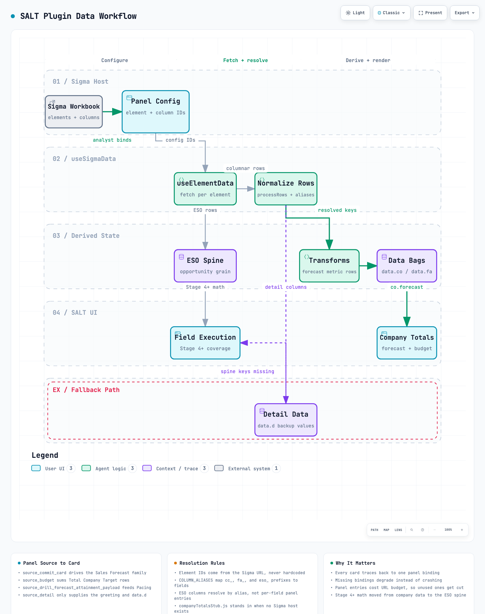
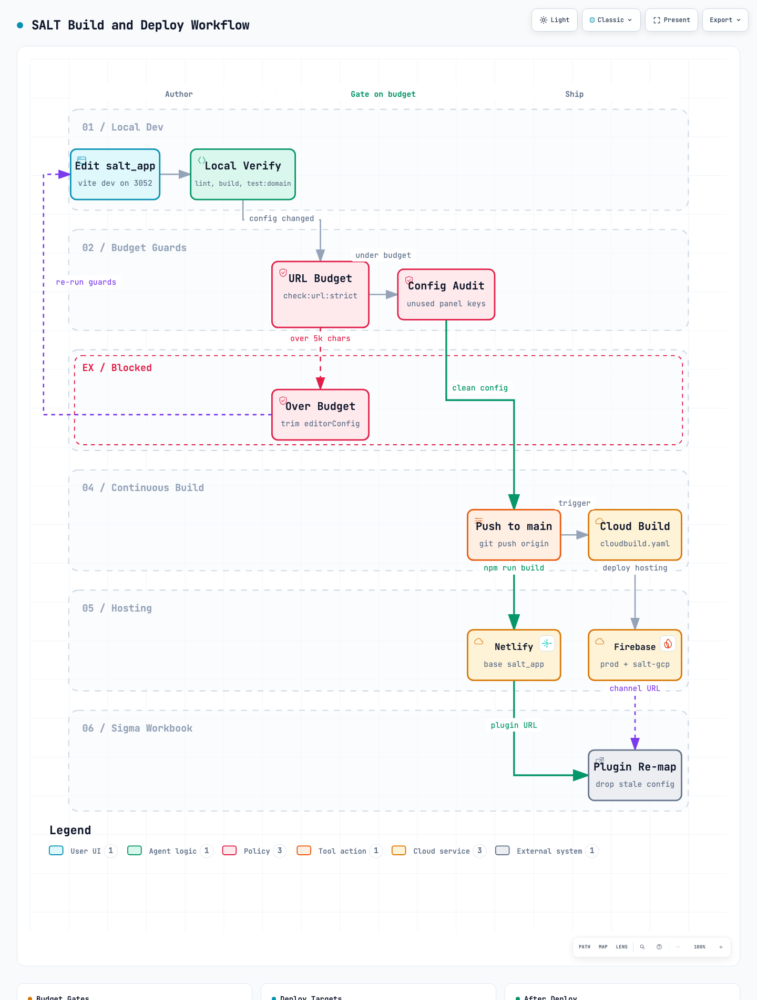

# SALT workflow diagrams

Two interactive workflow diagrams for the SALT Sigma plugin. Each one ships as a
self-contained HTML file (pan, zoom, search, focus, light/dark, export) plus a
PNG preview for quick reading in GitHub.

## Diagrams

### Plugin data workflow

How a Sigma binding becomes a card value, from the analyst picking elements in
the editor panel to `data.co` landing in Company Totals.

- Spec: `salt-plugin-data-flow.workflow.json`
- Viewer: `salt-plugin-data-flow.html`
- Preview: `salt-plugin-data-flow.png`



Code it describes:

| Step | Where it lives |
|---|---|
| Panel contract | `src/app/editorConfig.js` via `configureEditorPanel` |
| Element IDs | `src/sources/elementIds.js` (`buildSigmaSourceIds`) |
| Fetch | `useElementData` inside `src/hooks/useSigmaData.js` |
| Normalize | `processRows`, `resolveFieldKey`, `src/sigma/columnAliases.js` |
| Transforms | `buildForecastMetricRows`, `fa_payload` JSON parsing |
| Cards | `src/App.jsx` reads `data.co`, `data.fa`, `data.dv` |

### Build and deploy workflow

Local edit through the URL budget gates to Netlify, Cloud Build, Firebase, and
the plugin re-map back in Sigma.

- Spec: `salt-build-deploy.workflow.json`
- Viewer: `salt-build-deploy.html`
- Preview: `salt-build-deploy.png`



Guards it describes: `npm run check:url:strict`
(`scripts/check_plugin_url_size.mjs`, soft 12,000 / hard 5,000 config chars,
7,500 URL proxy) and `npm run audit:config`.

## Regenerating

The diagrams are generated by [archify](https://github.com/tt-a1i/archify). Edit
the JSON spec, then validate and deliver:

```bash
cd salt_app/docs/diagrams
node <archify>/bin/archify.mjs validate workflow salt-plugin-data-flow.workflow.json --quality showcase --json
node <archify>/bin/archify.mjs deliver  workflow salt-plugin-data-flow.workflow.json salt-plugin-data-flow.html --quality showcase --json
```

Both specs currently pass `showcase` with 9/9 artifact checks and zero
composition errors or warnings. Refresh a PNG preview with headless Chrome:

```bash
"/Applications/Google Chrome.app/Contents/MacOS/Google Chrome" \
  --headless --disable-gpu --hide-scrollbars --window-size=1440,1900 \
  --screenshot=salt-plugin-data-flow.png --virtual-time-budget=4000 \
  "file://$PWD/salt-plugin-data-flow.html"
```

`archify visual-check` reports vertical overflow for both files: a six-lane
workflow is taller than a 900px viewport, so the page scrolls. There is no
horizontal overflow and the readability check passes at every desktop size.

## Related material

These diagrams cover the plugin runtime and its release path. For the warehouse
side of the stack (Salesforce to Fivetran to Snowflake to dbt to Sigma), see the
in-app views `src/components/architecture/ArchitectureMapV2.jsx` and
`SaltDataFlowViz.jsx`, plus `public/help/salt-ecosystem-flowchart.png`.
